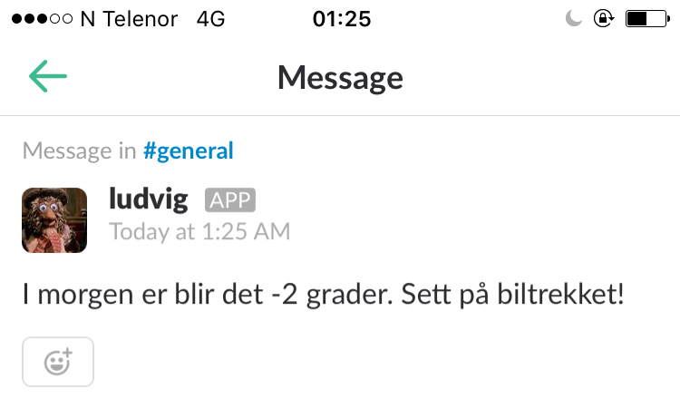

# car-cover-notifier [](https://travis-ci.org/ecrmnn/car-cover-notifier.svg?branch=master)

> Sends a Slack notification before a cold morning

### Installation
```bash
git clone https://github.com/ecrmnn/car-cover-notifier.git

pip install -r "requirements.txt"
```

### Usage
```bash
python main.py
```

<p align="center">
  
</p>

### License
MIT © [Daniel Eckermann](http://danieleckermann.com)